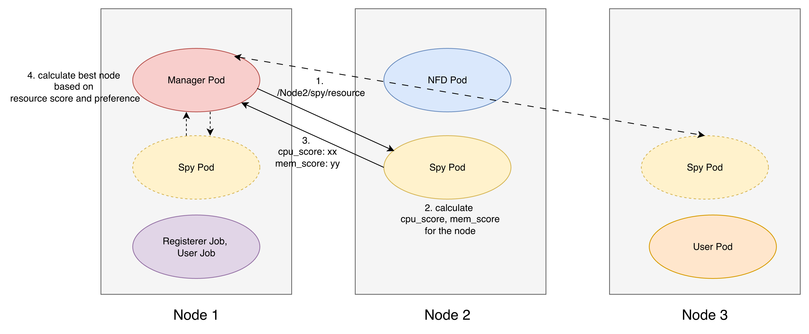

## 計算ロジック

### Spy

Node の CPU・メモリの使用率（%）を、それぞれ以下の式で空き容量のスコアに変換:

```text
score = max(0, int((80 - usage) / 80 × 100))
```

### Manager

CPU・メモリの優先度を重み（`high`: 3、`medium`: 2、`low`: 1、省略時は`medium`）に変換し、各ノードのスコアを計算:

```text
score = (cpu_score × cpu_weight + mem_score × memory_weight) / (cpu_weight + memory_weight)
```

総合スコアが最も高いノードに関数を配置する。
